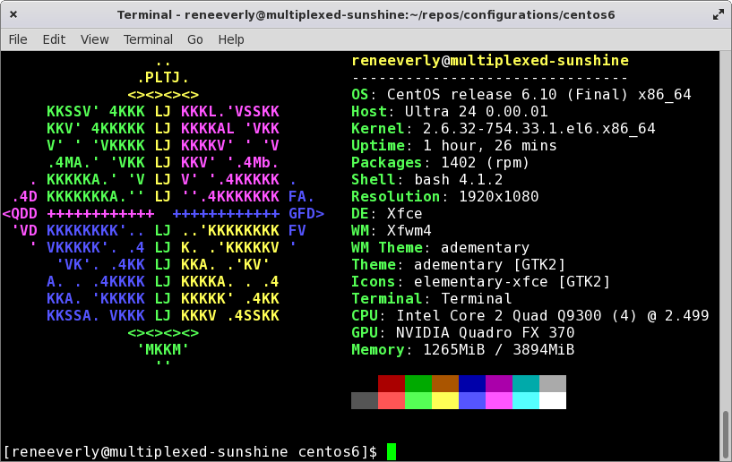

# CentOS 6.10 (final)

## Static IP

Set MAC address and place `ifcfg-eth0` in `/etc/sysconfig/network-scripts/`.

## Left Handed w/ Natural Scroll via X11 Config

Place `99-lefthand-naturalscroll.conf` in `/etc/X11/xorg.conf.d/`.

## Enable SSH on Boot

`chkconfig sshd on`

## Prevent System from Sleeping

Place `98-sleep-fix.conf` in `/etc/X11/xorg.conf.d/`.
